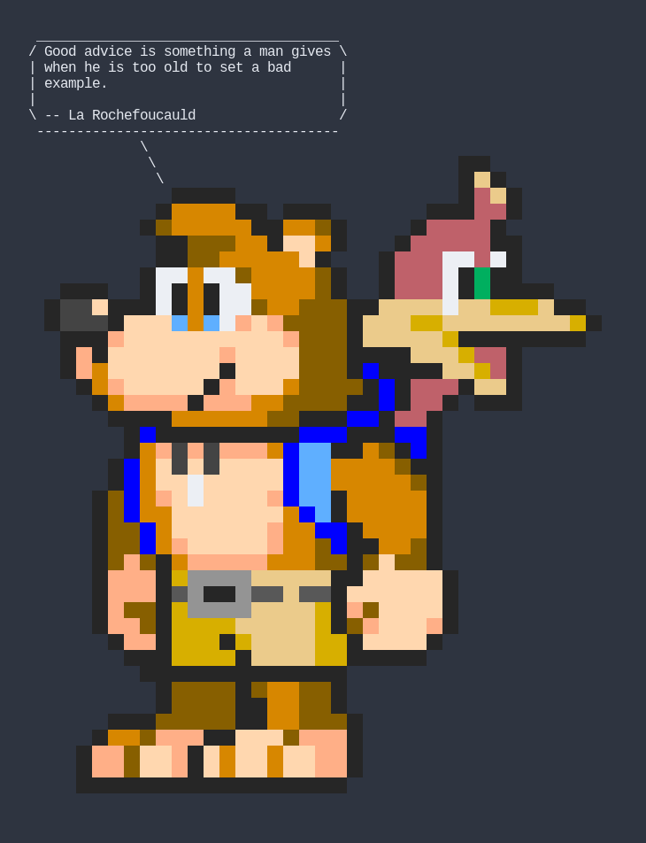
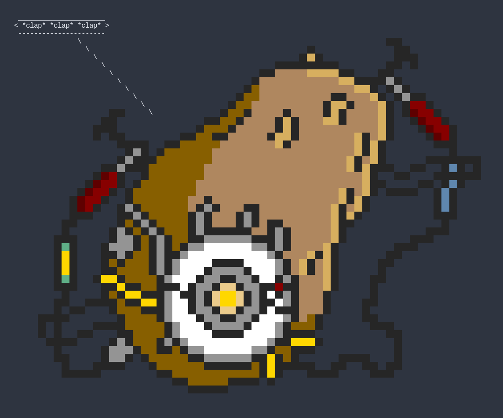

# Cowsay

<a href="https://nixos.wiki/wiki/Flakes" target="_blank">
	
</a>
<a href="https://github.com/snowfallorg/lib" target="_blank">
	
</a>

<p>
<!--
	This paragraph is not empty, it contains an em space (UTF-8 8195) on the next line in order
	to create a gap in the page.
-->
  
</p>

> More cows, optionally rendered as images!

<details>
	<summary>Examples</summary>





</details>

## Try Without Installing

You can run this flake's packages without committing to installing them by using the following commands.

### `cowsay`

```bash
nix run github:snowfallorg/cowsay -- "Hello, World"
```

### `cow2img`

```bash
nix run github:snowfallorg/cowsay#cow2img
```

## Install

First, include this flake as an input in your flake.

```nix
{
	description = "My awesome flake";

	inputs = {
		nixpkgs.url = "github:nixos/nixpkgs/nixos-22.11";

		# Snowfall Lib is not required, but will make configuration easier for you.
		snowfall-lib = {
			url = "github:snowfallorg/lib";
			inputs.nixpkgs.follows = "nixpkgs";
		};

		cowsay = {
			url = "github:snowfallorg/cowsay";
			inputs.nixpkgs.follows = "nixpkgs";
		};
	};
}
```

Then add the overlay or use the packages from this flake directly.

```nix
{
	description = "My awesome flake";

	inputs = {
		nixpkgs.url = "github:nixos/nixpkgs/nixos-22.05";

		# Snowfall Lib is not required, but will make configuration easier for you.
		snowfall-lib = {
			url = "github:snowfallorg/lib";
			inputs.nixpkgs.follows = "nixpkgs";
		};

		cowsay = {
			url = "github:snowfallorg/cowsay";
			inputs.nixpkgs.follows = "nixpkgs";
		};
	};

	outputs = inputs:
		inputs.snowfall-lib.mkFlake {
			inherit inputs;
			src = ./.;

			overlays = with inputs; [
				# To make this flake's packages available in your NixPkgs package set.
				cowsay.overlay
			];

			outputs-builder = channels:
				let
					inherit (channels.nixpkgs) system;
					# Use packages directly from the input instead.
					inherit (inputs.cowsay.packages.${system}) cowsay cow2img;
				in {
					# Use the packages in some way.
				};
		};
}
```

## Usage

### `cowsay`

The `cowsay` package in this flake acts as a wrapper for the original `cowsay` command.
However, instead of displaying a cow it will display a random image each time. Use it just
like the normal `cowsay` command.

```bash
cowsay "Hello, World"
```

### `cow2img`

The `cow2img` package in this flake will render the output of `fortune` and `cowsay` to
an image. See the following for help information.

```
cow2img

USAGE

  cow2img [options]

OPTIONS

  -h, --help              Show this help message
  -c, --cow <cowfile>     Use a specific cow file
  -m, --message <text>    Use a specific message
  -p, --pick              Pick a cow from a list

EXAMPLES

  $ # Render a random cow and quote.
  $ cow2img

  $ # Render a cow with a specific message.
  $ cow2img --message "Hello, World!"

  $ # Render a specific cow.
  $ cow2img --cow ./my.cow

  $ # Pick a cow.
  $ cow2img --pick
```
